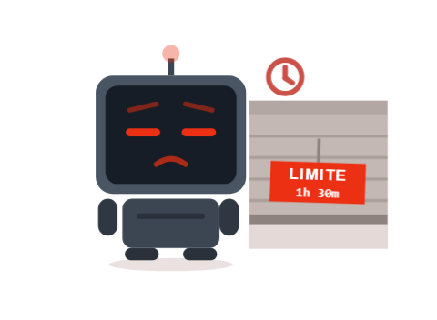

<div align="center">



<br>

**Amnis lives in a corner of your screen, mirrors what Claude Code is doing in real time,
and tells you how much quota you have left without you having to ask.**

<br>

[](https://github.com/termi7805/amnis-copilot/releases/latest)
[](#download)
[](#privacy)

<a href="README.md"></a><a href="README.en.md"></a>

<br>

[**Download**](#download) · [**What it does**](#what-it-does) · [**Getting started**](#getting-started) · [**Spotify**](#spotify-optional) · [**Privacy**](#privacy) · [**FAQ**](#faq)

</div>

<br>

## How it looks

The more of your 5-hour window you burn, the more tired it looks. One click shows the exact
numbers; open the dashboard for tokens, cost and activity by project and model.

> [!NOTE]
> Everything runs on your machine. No accounts, no cloud, and your transcripts never leave it.

## What it does

### The pet

It moves based on **Claude Code hooks**, not by guessing from text:

| | What Claude Code does | What Amnis does |
|:-:|---|---|
|  | Edits or writes files | Codes |
|  | Runs tests (`test`, `pytest`, `jest`, `vitest`, `cargo test`) | Runs tests |
|  | Reads, searches or browses | Researches |
|  | Is in plan mode | Plans |
|  | Runs other commands | Uses the terminal |
|  | Launches subagents | Coordinates subagents |
|  | `git commit` | Commits |
|  | `git push` | Pushes |
|  | **Asks for permission or asks you a question** | **Waits for you** |
|  | Has finished its turn | Rests |
|  | You've been idle for a while | Sleeps |
|  | You've hit your quota limit | Worn out |

<table>
<tr>
<td width="50%" valign="top">

**It tires with your quota**<br>
Fatigue is how much of the 5 h window you've used: fresh at the start, slower and with its
antenna dimming as you near the limit, and good as new once it resets. It never changes shape
or colour: only pace.

</td>
<td width="50%" valign="top">

**Click for the numbers**<br>
Opens a panel with the 5 h and 7 day windows, their bar and the countdown to reset. A figure
that is estimated rather than authoritative is marked with `~`.

</td>
</tr>
<tr>
<td width="50%" valign="top">

**Several sessions at once**<br>
Pin the pet to one session or leave it on automatic; a `+N` badge tells you how many others are
still working.

</td>
<td width="50%" valign="top">

**Music (optional)**<br>
With Spotify connected it puts on headphones and moves to the beat: bounces to upbeat songs,
floats to calm ones, bobs its head to the BPM. When the track changes it shows the cover on its
screen. See [Spotify](#spotify-optional).

</td>
</tr>
</table>

### The dashboard

Open `http://127.0.0.1:4747` in your browser:

| Tab | What you get |
|---|---|
| **Now** | Your live limits (5 h, 7 days and each model's own if your account has them), the projection of what % you'll hit at reset at the current pace and the time the window would run out, today's usage, the sessions waiting on you and the latest events. With Spotify connected, the player too. |
| **History** | Tokens and cost by day, project and model, and the daily peak of the 5 h window. Cost is the **API equivalent** (what you would have paid without a subscription), not real spend. |
| **Activity** | Where your time goes: a per-session timeline of the day, an hourly heatmap, a breakdown by state and a session table. |
| **Settings** | System health with a fix for each failure, your plan (auto-detected), visual themes and the pet's music layer. |

#### How much you use outside Claude Code

Amnis combines two sources at once: your account's **official %** (the same one you see on
claude.ai) and the **real tokens** from your Claude Code transcripts. The difference between the
two is what you spend elsewhere (chats on claude.ai, other devices…), and for the 7-day window it
breaks it down by origin.

## Download

Latest version on [Releases](https://github.com/termi7805/amnis-copilot/releases/latest).

| | Format | For | Download |
|---|---|---|---|
| Windows | `.exe` | Windows 10 and 11 (x86_64) | [`amnis-copilot-x86_64-setup.exe`](https://github.com/termi7805/amnis-copilot/releases/latest/download/amnis-copilot-x86_64-setup.exe) |
| macOS | `.dmg` | Apple Silicon Macs (M1 and later) | [`amnis-copilot-aarch64.dmg`](https://github.com/termi7805/amnis-copilot/releases/latest/download/amnis-copilot-aarch64.dmg) |
| macOS | `.dmg` | Intel Macs | [`amnis-copilot-x86_64.dmg`](https://github.com/termi7805/amnis-copilot/releases/latest/download/amnis-copilot-x86_64.dmg) |
| Linux | AppImage | Any Linux distro, no install | [`amnis-copilot-x86_64.AppImage`](https://github.com/termi7805/amnis-copilot/releases/latest/download/amnis-copilot-x86_64.AppImage) |
| Linux | `.deb` | Debian, Ubuntu, Parrot… | [`amnis-copilot-amd64.deb`](https://github.com/termi7805/amnis-copilot/releases/latest/download/amnis-copilot-amd64.deb) |
| Linux | `.rpm` | Fedora, openSUSE… | [`amnis-copilot-x86_64.rpm`](https://github.com/termi7805/amnis-copilot/releases/latest/download/amnis-copilot-x86_64.rpm) |

> [!IMPORTANT]
> **Requirements:** Claude Code installed and signed in with a subscription (Pro or Max).
> You don't need Node or Rust: everything ships inside the app.

<details>
<summary><b>Install on Windows</b></summary>

<br>

Run `amnis-copilot-x86_64-setup.exe`: it installs the app for your user, with no administrator
permissions. It isn't signed with a code-signing certificate, so the first time SmartScreen
blocks it ("Windows protected your PC"): click **More info → Run anyway**.

Amnis' hooks are an `sh` script, as on Linux and macOS: Claude Code runs them with Git Bash,
which you already have because Claude Code needs it on Windows.

</details>

<details>
<summary><b>Install on macOS</b></summary>

<br>

Open the `.dmg` and drag **Amnis Copilot** to Applications. The app isn't signed with an Apple
Developer account, so the first time macOS blocks it ("is damaged" or "cannot verify the
developer"). To remove the quarantine:

```bash
xattr -dr com.apple.quarantine "/Applications/Amnis Copilot.app"
```

You can also try opening it and then go to **System Settings → Privacy & Security → Open
Anyway**. The first time it reads your quota, macOS will ask for permission to access the
keychain, where Claude Code stores its session.

</details>

<details>
<summary><b>Install on Linux</b></summary>

<br>

```bash
# AppImage
chmod +x amnis-copilot-x86_64.AppImage && ./amnis-copilot-x86_64.AppImage

# .deb
sudo apt install ./amnis-copilot-amd64.deb

# .rpm
sudo dnf install ./amnis-copilot-x86_64.rpm
```

</details>

## Getting started

1. **Open the app.** The pet appears.
2. **Connect Claude Code.** Open the dashboard at `http://127.0.0.1:4747`, go to **Settings** and
   click **Repair hooks**. Amnis adds its hooks to `~/.claude/settings.json` without touching the
   ones you already have, and makes a backup first.
3. **Use Claude Code as usual.** Sessions you open from now on move the pet. Usage history is
   imported automatically from your transcripts, including anything from before you installed
   Amnis.

> [!TIP]
> If something looks off, **Settings → Health** checks hooks, credentials, the connection to
> Anthropic, the database and ingestion, and tells you how to fix each failure.

## Spotify (optional)

Spotify doesn't hand out a shared Client ID for apps like this, so each user registers their own
(free, a couple of minutes). You need **Spotify Premium**.

1. Create an app in the [Spotify developer dashboard](https://developer.spotify.com/dashboard)
   with this *Redirect URI*, exactly:
   `http://127.0.0.1:4747/api/spotify/callback`
2. Save its Client ID in `~/.amnis/spotify.json`:
   ```json
   { "clientId": "YOUR_CLIENT_ID" }
   ```
3. In the dashboard, **Settings → Health → Spotify → Connect**.

To get each song's tempo and mood, Amnis sends its ID to [ReccoBeats](https://reccobeats.com)
(Spotify removed that data from its API). If it doesn't respond, the pet dances with its neutral
animation and nothing else changes. Everything visual about the music layer can be tuned, or
turned off, in **Settings → Pet · Music**.

## Privacy

| | |
|---|---|
| **What it reads** | The transcripts in `~/.claude/projects/` (usage metadata only: tokens, model, project, time; never prompts or code) and Claude Code's credentials (`~/.claude/.credentials.json` on Linux and Windows, the keychain on macOS). |
| **What it writes** | Its hooks in `~/.claude/settings.json` (with a backup) and its data in `~/.amnis/` (`%USERPROFILE%\.amnis\` on Windows). **It never writes to your Claude Code credentials**: if it has to renew the token, it keeps its own separately. |
| **What leaves your machine** | Only the quota query to Anthropic with your own session every 3 minutes and, if you connect Spotify, the calls to Spotify and ReccoBeats. Nothing else. |
| **Where it listens** | Everything listens on `127.0.0.1` only: the dashboard isn't reachable from other machines. |

## FAQ

<details>
<summary><b>The pet doesn't move</b></summary>

<br>

Check in **Settings → Health** that the hooks are installed (if not, **Repair hooks**). If a
Claude Code session that was already open before you installed them doesn't react, restart it.

</details>

<details>
<summary><b>Percentages show a <code>~</code></b></summary>

<br>

Amnis couldn't query the official % (no network, expired Claude Code session…) and is
estimating from your transcripts. It goes away on its own once the query works again.

</details>

<details>
<summary><b>Does it slow Claude Code down?</b></summary>

<br>

No. The hooks send the event and carry on without waiting for a reply, with a 1.5 s maximum; if
Amnis is closed they fail silently and Claude Code doesn't notice.

</details>

<details>
<summary><b>Do I lose data if I close the app?</b></summary>

<br>

Usage, no: when you reopen it, everything you did in the meantime is re-imported from the
transcripts. What isn't recovered is what only exists live: the official % series and the pet's
activity during that time.

</details>

<details>
<summary><b>Can I change the port?</b></summary>

<br>

Yes, with the `AMNIS_PORT` environment variable (default `4747`). If you use Spotify, update
your app's *Redirect URI* with the new port.

</details>

<details>
<summary><b>Does it work with Antigravity, Cursor or other agents?</b></summary>

<br>

Only with Claude Code today. Antigravity is planned.

</details>

<details>
<summary><b>How do I uninstall it?</b></summary>

<br>

Remove the hooks from `~/.claude/settings.json`: they're the entries whose command contains
`amnis-hook` (from source, `node packages/daemon/src/cli.ts uninstall-hooks` does it for you).
Then uninstall the app like any other and delete `~/.amnis/` if you don't want to keep its data.

</details>

## Development

pnpm monorepo with Node 24. Architecture and decisions in [`docs/DESIGN.md`](docs/DESIGN.md) and
[`docs/STACK.md`](docs/STACK.md) (in Spanish).

```bash
pnpm install
pnpm dev          # daemon + dashboard with hot reload
pnpm test && pnpm typecheck && pnpm lint
```

The daemon ships a CLI (`node packages/daemon/src/cli.ts --help`): `doctor`, `ingest`,
`install-hooks`, `uninstall-hooks`, `spotify login`…

Building the app needs Rust (and on Linux, `libwebkit2gtk-4.1-dev`):
`pnpm --filter @amnis/pet build`.

<details>
<summary><b>Publishing a release</b></summary>

<br>

Bump the version in the `package.json` files, `apps/pet/src-tauri/tauri.conf.json`,
`Cargo.toml` / `Cargo.lock` and `VERSION` in `packages/daemon/src/config.ts`; merge it into
`main` and push the tag:

```bash
git tag v0.2.0 && git push origin v0.2.0
```

The `Release` workflow builds the Linux, macOS and Windows packages and publishes the release.
It fails if the tag doesn't match the version in `tauri.conf.json`. Run by hand
(`gh workflow run Release --ref <branch>`) it builds and tests everything without publishing
anything.

</details>
