<div align="center">



<br>

**Amnis vive en una esquina de tu pantalla, refleja en tiempo real lo que hace Claude Code
y te dice cuánta cuota te queda sin que tengas que preguntarlo.**

<br>

[](https://github.com/termi7805/amnis-copilot/releases/latest)
[](#descarga)
[](#privacidad)

[**Descargar**](#descarga) · [**Qué hace**](#qué-hace) · [**Primeros pasos**](#primeros-pasos) · [**Spotify**](#spotify-opcional) · [**Privacidad**](#privacidad) · [**FAQ**](#preguntas-frecuentes)

</div>

<br>

## Cómo se ve

Cuanto más gastas de tu ventana de 5 horas, más cansada se la ve. Un click y tienes las cifras
exactas; abre el dashboard y tienes el detalle de tokens, coste y actividad por proyecto y modelo.

> [!NOTE]
> Todo corre en tu máquina. Sin cuentas, sin nube, y tus transcripts nunca salen de ella.

## Qué hace

### La mascota

Se mueve a partir de los **hooks de Claude Code**, no adivinando leyendo texto:

| | Lo que hace Claude Code | Lo que hace Amnis |
|:-:|---|---|
|  | Edita o escribe ficheros | Programa |
|  | Lanza tests (`test`, `pytest`, `jest`, `vitest`, `cargo test`) | Pasa tests |
|  | Lee, busca o navega | Investiga |
|  | Está en modo plan | Planifica |
|  | Ejecuta otros comandos | Usa la terminal |
|  | Lanza subagentes | Coordina subagentes |
|  | `git commit` | Hace commit |
|  | `git push` | Hace push |
|  | **Te pide permiso o te hace una pregunta** | **Te espera** |
|  | Ha terminado su turno | Descansa |
|  | Llevas un rato sin actividad | Duerme |
|  | Has llegado al límite de cuota | Agotada |

<table>
<tr>
<td width="50%" valign="top">

**Se cansa con tu cuota**<br>
La fatiga es el consumo de la ventana de 5 h: fresca al empezar, lenta y con la antena
apagándose al acercarte al límite, y como nueva en cuanto se resetea. Nunca cambia de forma ni
de color: solo de ritmo.

</td>
<td width="50%" valign="top">

**Click para ver las cifras**<br>
Despliega un panel con las ventanas de 5 h y 7 días, su barra y la cuenta atrás hasta el reset.
Si un dato es estimado y no autoritativo, se marca con `~`.

</td>
</tr>
<tr>
<td width="50%" valign="top">

**Varias sesiones a la vez**<br>
Fija la mascota en una sesión concreta o déjala en automático; una insignia `+N` te avisa de
cuántas otras siguen trabajando.

</td>
<td width="50%" valign="top">

**Música (opcional)**<br>
Con Spotify conectado se pone cascos y se mueve al ritmo de la canción: rebota con lo festivo,
flota con lo tranquilo, cabecea al BPM. Al cambiar de canción enseña la portada en su pantalla.
Ver [Spotify](#spotify-opcional).

</td>
</tr>
</table>

### El dashboard

Abre `http://127.0.0.1:4747` en el navegador:

| Pestaña | Qué te da |
|---|---|
| **Ahora** | Tus límites en vivo (5 h, 7 días y los propios de cada modelo si tu cuenta los tiene), la proyección de a qué % llegarás en el reset al ritmo actual y la hora a la que se agotaría la ventana, el consumo de hoy, las sesiones que te están esperando y los últimos eventos. Con Spotify conectado, también el reproductor. |
| **Histórico** | Tokens y coste por día, proyecto y modelo, y el pico diario de la ventana de 5 h. El coste es el **equivalente de API** (lo que habrías pagado sin suscripción), no un gasto real. |
| **Actividad** | En qué se te va el tiempo: línea del día por sesión, mapa de calor por horas, reparto por estado y tabla de sesiones. |
| **Ajustes** | Salud del sistema con el remedio de cada fallo, tu plan (detectado automáticamente), temas visuales y la capa de música de la mascota. |

#### Cuánto consumes fuera de Claude Code

Amnis combina dos fuentes a la vez: el **% oficial** de tu cuenta (el mismo que ves en claude.ai)
y los **tokens reales** de tus transcripts de Claude Code. La diferencia entre ambas es lo que
gastas en otros sitios (chats en claude.ai, otros dispositivos…), y para la ventana de 7 días te
lo desglosa por origen.

## Descarga

Última versión en [Releases](https://github.com/termi7805/amnis-copilot/releases/latest).

| Formato | Para | Descarga |
|---|---|---|
| `.exe` | Windows 10 y 11 (x86_64) | [`amnis-copilot-x86_64-setup.exe`](https://github.com/termi7805/amnis-copilot/releases/latest/download/amnis-copilot-x86_64-setup.exe) |
| `.dmg` | Mac con Apple Silicon (M1 y posteriores) | [`amnis-copilot-aarch64.dmg`](https://github.com/termi7805/amnis-copilot/releases/latest/download/amnis-copilot-aarch64.dmg) |
| `.dmg` | Mac con Intel | [`amnis-copilot-x86_64.dmg`](https://github.com/termi7805/amnis-copilot/releases/latest/download/amnis-copilot-x86_64.dmg) |
| AppImage | Cualquier distro Linux, sin instalar | [`amnis-copilot-x86_64.AppImage`](https://github.com/termi7805/amnis-copilot/releases/latest/download/amnis-copilot-x86_64.AppImage) |
| `.deb` | Debian, Ubuntu, Parrot… | [`amnis-copilot-amd64.deb`](https://github.com/termi7805/amnis-copilot/releases/latest/download/amnis-copilot-amd64.deb) |
| `.rpm` | Fedora, openSUSE… | [`amnis-copilot-x86_64.rpm`](https://github.com/termi7805/amnis-copilot/releases/latest/download/amnis-copilot-x86_64.rpm) |

> [!IMPORTANT]
> **Requisitos:** Claude Code instalado y con la sesión iniciada con una suscripción (Pro o Max).
> No hace falta Node ni Rust: todo va dentro de la app.

<details>
<summary><b>Instalar en Windows</b></summary>

<br>

Ejecuta `amnis-copilot-x86_64-setup.exe`: instala la app para tu usuario, sin pedir permisos de
administrador. No está firmada con un certificado de código, así que la primera vez SmartScreen
la bloquea ("Windows protegió su PC"): pulsa **Más información → Ejecutar de todas formas**.

Los hooks de Amnis son un script `sh`, igual que en Linux y macOS: Claude Code los ejecuta con
Git Bash, que ya tienes porque Claude Code lo necesita en Windows.

</details>

<details>
<summary><b>Instalar en macOS</b></summary>

<br>

Abre el `.dmg` y arrastra **Amnis Copilot** a Aplicaciones. La app no está firmada con una cuenta
de Apple Developer, así que la primera vez macOS la bloquea ("está dañada" o "no se puede
verificar el desarrollador"). Para quitarle la cuarentena:

```bash
xattr -dr com.apple.quarantine "/Applications/Amnis Copilot.app"
```

También puedes intentar abrirla y luego ir a **Ajustes del Sistema → Privacidad y seguridad →
Abrir igualmente**. La primera vez que lea la cuota, macOS te pedirá permiso para acceder al
llavero, donde Claude Code guarda su sesión.

</details>

<details>
<summary><b>Instalar en Linux</b></summary>

<br>

```bash
# AppImage
chmod +x amnis-copilot-x86_64.AppImage && ./amnis-copilot-x86_64.AppImage

# .deb
sudo apt install ./amnis-copilot-amd64.deb

# .rpm
sudo dnf install ./amnis-copilot-x86_64.rpm
```

</details>

## Primeros pasos

1. **Abre la app.** Aparece la mascota.
2. **Conecta Claude Code.** Abre el dashboard en `http://127.0.0.1:4747`, ve a **Ajustes** y pulsa
   **Reparar hooks**. Amnis añade sus hooks a `~/.claude/settings.json` sin tocar los que ya
   tengas, y guarda antes una copia de seguridad.
3. **Usa Claude Code como siempre.** Las sesiones que abras a partir de ahora mueven la mascota.
   El historial de uso se importa solo de tus transcripts, incluido lo de antes de instalar Amnis.

> [!TIP]
> Si algo no cuadra, **Ajustes → Salud** revisa hooks, credenciales, conexión con Anthropic, base
> de datos e ingesta, y te dice cómo arreglar cada fallo.

## Spotify (opcional)

Spotify no reparte un Client ID compartido para apps como esta, así que cada usuario registra la
suya (gratis, un par de minutos). Necesitas **Spotify Premium**.

1. Crea una app en el [dashboard de desarrolladores de Spotify](https://developer.spotify.com/dashboard)
   con este *Redirect URI*, exactamente:
   `http://127.0.0.1:4747/api/spotify/callback`
2. Guarda su Client ID en `~/.amnis/spotify.json`:
   ```json
   { "clientId": "TU_CLIENT_ID" }
   ```
3. En el dashboard, **Ajustes → Salud → Spotify → Conectar**.

Para saber el ritmo y el ánimo de cada canción, Amnis envía su ID a
[ReccoBeats](https://reccobeats.com) (Spotify retiró ese dato de su API). Si no responde, la
mascota baila con su animación neutra y nada más cambia. Todo lo visual de la capa de música se
ajusta, o se apaga, en **Ajustes → Mascota · Música**.

## Privacidad

| | |
|---|---|
| **Lo que lee** | Los transcripts de `~/.claude/projects/` (solo metadatos de uso: tokens, modelo, proyecto, hora; nunca prompts ni código) y las credenciales de Claude Code (`~/.claude/.credentials.json` en Linux y Windows, el llavero en macOS). |
| **Lo que escribe** | Sus hooks en `~/.claude/settings.json` (con copia de seguridad) y sus datos en `~/.amnis/` (`%USERPROFILE%\.amnis\` en Windows). **Nunca escribe en tus credenciales de Claude Code**: si tiene que renovar el token, guarda el suyo aparte. |
| **Lo que sale de tu máquina** | Solo la consulta de cuota a Anthropic con tu propia sesión cada 3 minutos y, si conectas Spotify, las llamadas a Spotify y ReccoBeats. Nada más. |
| **Dónde escucha** | Todo escucha solo en `127.0.0.1`: el dashboard no es accesible desde otras máquinas. |

## Preguntas frecuentes

<details>
<summary><b>La mascota no se mueve</b></summary>

<br>

Comprueba en **Ajustes → Salud** que los hooks están instalados (si no, **Reparar hooks**). Si
una sesión de Claude Code que ya estaba abierta antes de instalarlos no reacciona, reiníciala.

</details>

<details>
<summary><b>Los porcentajes salen con <code>~</code></b></summary>

<br>

Amnis no ha podido consultar el % oficial (sin red, sesión de Claude Code caducada…) y está
estimando a partir de tus transcripts. Vuelve solo cuando la consulta funciona.

</details>

<details>
<summary><b>¿Ralentiza a Claude Code?</b></summary>

<br>

No. Los hooks envían el evento y siguen sin esperar respuesta, con un tiempo máximo de 1,5 s; si
Amnis está cerrada, fallan en silencio y Claude Code no se entera.

</details>

<details>
<summary><b>¿Pierdo datos si cierro la app?</b></summary>

<br>

El uso no: al volver a abrirla se reimporta de los transcripts todo lo que hiciste mientras
tanto. Lo que no se recupera es lo que solo existe en vivo: la serie del % oficial y la
actividad de la mascota durante ese rato.

</details>

<details>
<summary><b>¿Puedo cambiar el puerto?</b></summary>

<br>

Sí, con la variable de entorno `AMNIS_PORT` (por defecto `4747`). Si usas Spotify, actualiza el
*Redirect URI* de tu app con el nuevo puerto.

</details>

<details>
<summary><b>¿Funciona con Antigravity, Cursor u otros agentes?</b></summary>

<br>

Hoy solo con Claude Code. Antigravity está previsto.

</details>

<details>
<summary><b>¿Cómo la desinstalo?</b></summary>

<br>

Quita los hooks de `~/.claude/settings.json`: son las entradas cuyo comando contiene
`amnis-hook` (desde el código fuente, `node packages/daemon/src/cli.ts uninstall-hooks` lo hace
por ti). Después desinstala la app como cualquier otra y borra `~/.amnis/` si no quieres
conservar sus datos.

</details>

## Desarrollo

Monorepo pnpm con Node 24. Arquitectura y decisiones en [`docs/DESIGN.md`](docs/DESIGN.md) y
[`docs/STACK.md`](docs/STACK.md).

```bash
pnpm install
pnpm dev          # daemon + dashboard en caliente
pnpm test && pnpm typecheck && pnpm lint
```

El daemon trae un CLI (`node packages/daemon/src/cli.ts --help`): `doctor`, `ingest`,
`install-hooks`, `uninstall-hooks`, `spotify login`…

Para compilar la app hace falta Rust (y en Linux, `libwebkit2gtk-4.1-dev`):
`pnpm --filter @amnis/pet build`.

<details>
<summary><b>Publicar una versión</b></summary>

<br>

Sube la versión en los `package.json`, `apps/pet/src-tauri/tauri.conf.json`, `Cargo.toml` /
`Cargo.lock` y `VERSION` de `packages/daemon/src/config.ts`; intégrala en `main` y sube el tag:

```bash
git tag v0.2.0 && git push origin v0.2.0
```

El workflow `Release` construye los paquetes de Linux, macOS y Windows y publica la release.
Falla si el tag no coincide con la versión de `tauri.conf.json`. Lanzado a mano
(`gh workflow run Release --ref <rama>`) compila y prueba todo sin publicar nada.

</details>
